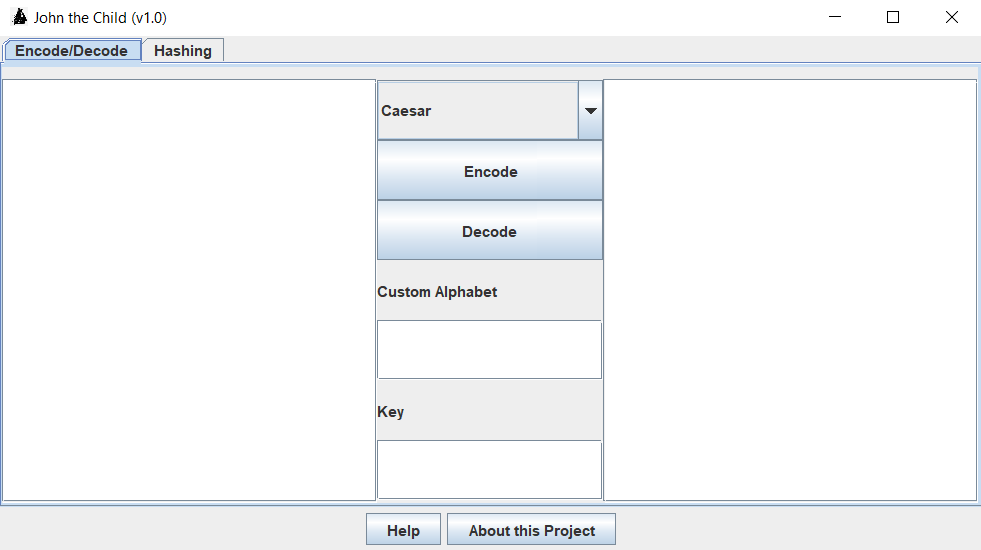

# John the Child
> A final project for Object Oriented Programming
<p align="center">
    
</p>

## What is John the Child?
What was once a child-like attempt to be one-man team behind another cryptography application has become a nice starter for anyone interested in developing a project but doesn't want to work from a blank slate. This was originally created to be a final project for an OOP class, and now serves as an instructional tool for software development.
Pull requests and issues will likely be ignored unless there's good reason not to.
<hr>
<p align="center">
    
</p>

### The Technical Details (thus far...)
<ul>
    <li><b>2+ Ciphers Supported</b> New ciphers yet to come!</li>
    <li><b>Custom Alphabets</b> that you have to type out if you want to use it</li>
    <li><b>Multithreaded Hash Cracking</b> Currently supporting MD5, SHA-1, and SHA-256</li>
    <li><b>Programmed exclusively in Java:</b> I'm sorry.</li>
</ul>

> "He gets the job done!"  

<br>
Author: Ryan S. (rsyed.business404@gmail.com)

Build Instructions:
1. Make sure you have Java installed
2. Keep all files in the same directory
3. In shell:
```shell
> javac *.java
> java Johnny
```
4. Have fun!

> Credit to [danielmiessler](github.com/danielmiessler) for the wordlist currently being used in this program. Also credit to GeeksForGeeks for their hashing code.
